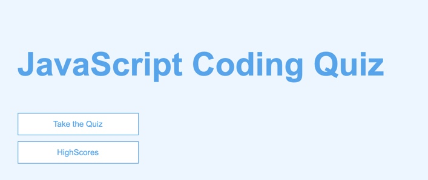

<!-- PROJECT INTRO -->
 

  

  <h3 align="center">JavaScript Quiiz</h3>

  

    An awesome password generator to help you secure your information!
     
    <a href="https://github.com/heather-everton/js-quiz"><strong>Explore the docs »</strong></a>
     
     
    <a href="https://heather-everton.github.io/js-quiz/">View Demo</a>
    ·
    <a href="https://github.com/heather-everton/js-quiz/issues">Report Bug</a>
    ·
    <a href="https://github.com/heather-everton/js-quiz/issues">Request Feature</a>
  

<!-- TABLE OF CONTENTS -->
## Table of Contents

* [About the Project](#about-the-project)
  * [Built With](#built-with)
* [Getting Started](#getting-started)
* [Roadmap](#roadmap)

<!-- ABOUT THE PROJECT -->
## About The Project

Take a quick quiz to test your knowledge of basic JavaScript. 

Here's why:
* You don't want to hire applicants without testing for understanding of the basics.
* You can easily compare results of various applicants. 
* You can't afford to spend time trying to figure out if applicants are qualified without a quiz. 

A list of commonly used resources that I find helpful are listed in the acknowledgements.

### Built With
* [JavaScript](https://javascript.com)
* [html](https://html.com)
* [css](https://free-css.com)

<!-- GETTING STARTED -->
## Getting Started

To get started simply click on "Take the Quiz" and select the answers for each quesitoin.

<!-- ROADMAP -->
## Roadmap

See the [open issues](https://github.com/heather-everton/js-quiz/issues) for a list of proposed features (and known issues).